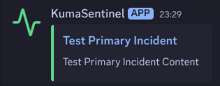
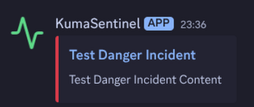
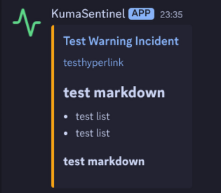
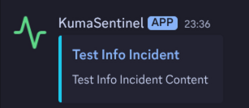
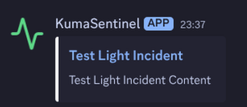
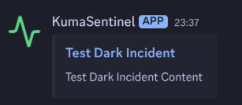
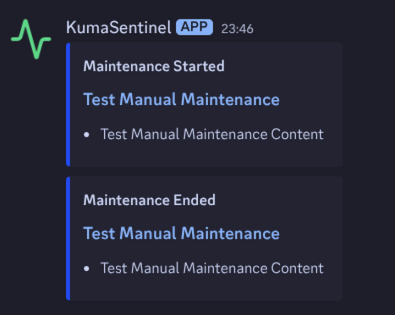
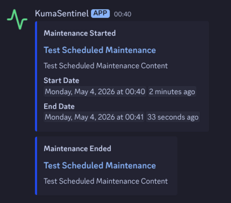

# KumaBroadcast
This script scrapes uptime kuma status pages and publishes incidents and maintenance posts to discord via webhooks

## Showcase

### Incidents

| Primary | Danger | Warning | Info |
|---------|--------|---------|------|
|  |  |  |  |

| Light | Dark |
|-------|------|
|  |  |

### Maintenance Notifications

#### Manual Maintenance



#### Scheduled Maintenance



### Markdown Rendering

The script will try to render markdown syntax from incidents and maintenance posts into discord markdown


## Usage

### Setup

1. **Create a folder** for the script
2. **Download** `kumasentinel.py` and move it to your folder
3. **Create a `.env` configuration file** in the same directory

### Configuration

Create a `.env` file in the script directory with the following variables:

#### Required Fields

```env
STATUS_PAGE_URL=https://your-uptime-kuma-status-page.com
DISCORD_WEBHOOK_URL=https://discord.com/api/webhooks/YOUR_WEBHOOK_ID/YOUR_WEBHOOK_TOKEN
```

- `STATUS_PAGE_URL`: The URL to your Uptime Kuma status page
- `DISCORD_WEBHOOK_URL`: Your Discord channel webhook URL

#### Optional Fields

```env
EMBED_LINK_URL=https://your-custom-link.com
WEBHOOK_USERNAME=KumaBroadcast
WEBHOOK_AVATAR=https://example.com/avatar.png
```

- `EMBED_LINK_URL`: Custom URL for Discord embed links (defaults to `STATUS_PAGE_URL`)
<<<<<<< Updated upstream
<<<<<<< Updated upstream
- `WEBHOOK_USERNAME`: Username displayed in Discord messages (defaults to "KumaSentinel", set to "none" to disable)
- `WEBHOOK_AVATAR`: Avatar URL for Discord messages (set to "none" to disable)
=======
=======
>>>>>>> Stashed changes
- `WEBHOOK_USERNAME`: Username displayed in Discord messages (defaults to "KumaBroadcast", set to "none" to disable)
- `WEBHOOK_AVATAR`: Avatar URL for Discord messages (defaults to built-in avatar, set to "none" to disable)
>>>>>>> Stashed changes

### Running the Script

This script is designed to run as a cronjob for periodic monitoring. The recommended interval is **every minute** for best accuracy, or **every 5 minutes** for less frequent checks.

#### Cron Example

```bash
# Run every minute
* * * * * /usr/bin/python3 /path/to/kumasentinel.py

# Or run every 5 minutes
*/5 * * * * /usr/bin/python3 /path/to/kumasentinel.py
```

> [!NOTE]
> This script will not scrape monitor status since discord up/down notifications are already a feature of uptime kuma

## Credits

The default avatar used by the webhook is based on the **activity** icon from [Lucide Icons](https://github.com/lucide-icons/lucide)